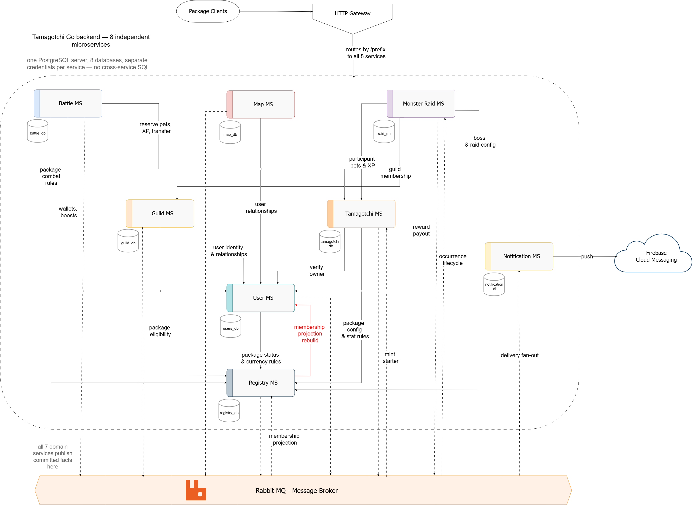

# Tamagotchi Go

Shared backend for virtual pet apps. Different frontend packages ship their own
creatures, art and care rules, and all of them run on these eight services.


## Team

| Member | Services | Language |
|---|---|---|
| Patricia | User Management, Battle | C#, ASP.NET Core |
| Victoria | Tamagotchi, Notification | TypeScript, Node.js |
| Mihaela | Guild, Package Registry | TypeScript, Node.js |
| Sergiu | Map, Monster Raid | C#, ASP.NET Core |


## Repository

Each service has its own private repository. Only the professor is invited to
them, not teammates. They are linked here as submodules.

| Service | Submodule path | Owner |
|---|---|---|
| User Management | `services/user-management` | Patricia |
| Battle | `services/battle` | Patricia |
| Tamagotchi | `services/tamagotchi` | Victoria |
| Notification | `services/notification` | Victoria |
| Guild | `services/guild` | Mihaela |
| Package Registry | `services/package-registry` | Mihaela |
| Map | `services/map` | Sergiu |
| Monster Raid | `services/monster-raid` | Sergiu |

## Service boundaries

Each service owns one part of the game and one database. Nothing reads another
service's tables.

| Service | Owns | Does not own |
|---|---|---|
| User Management | Accounts, login, JWT issuing, friends, enemies, global and local currency, which packages a user joined | Anything about creatures or battles |
| Tamagotchi | Creatures, owner, primary and secondary role, combat type, level, XP, raw package stats | Damage, battle outcome, what the stats mean |
| Battle | Challenges, turns, damage, who won, XP split, capture decision | Creature state, currency balances |
| Guild | Guilds, members, roles, invitations, chat | User identity, raid state |
| Package Registry | Packages, stat definitions, bonus rules, starter config, assets, bosses, raid schedule | User data, live raids |
| Map | Latest locations, freshness, who is nearby | Friend lists, battles |
| Monster Raid | Live raids, boss HP, attacks, damage per player, rewards | Boss definitions, guild membership |
| Notification | Devices, push tokens, delivery, history, mute settings | Every domain decision, message text |

Two rules keep the boundaries honest. Battle decides, Tamagotchi applies.
Package Registry holds configuration, the runtime services hold state.

## Architecture



Every client goes through the HTTP Gateway. It routes by path prefix to the eight
services, so a frontend package never learns where a service lives or how many
replicas answer.

The dashed box holds the services themselves. Each one owns a single database on
a shared PostgreSQL server, with its own user and grants, so there is no
cross-service SQL. When a service needs something it does not own, it asks the
owner over HTTP: Battle reserves pets and writes XP through Tamagotchi, Monster
Raid checks guild membership with Guild, Map resolves relationships through User
Management, and everyone reads combat rules, stat definitions and starter config
from Package Registry. Those calls are synchronous because the caller cannot
continue without the answer.

Everything that already happened goes on the bus instead. All seven domain
services publish committed facts to RabbitMQ, and the consumers decide what
matters to them. Notification is the largest one: it turns those facts into
delivery fan-out and pushes to phones through Firebase Cloud Messaging, without
any publisher knowing it exists. Registry also keeps a membership projection
from User Management events, so package eligibility checks stay local.

The one edge drawn in red is the exception to the usual flow: the membership
projection rebuild between User Management and Registry, used to repair that
copy when it drifts.

## Technologies

| Service | Stack | Database | Why |
|---|---|---|---|
| User Management | C#, ASP.NET Core | PostgreSQL | Money and identity need strict typing and real transactions |
| Battle | C#, ASP.NET Core | PostgreSQL | Turn state and settlement retries, same reason |
| Tamagotchi | TypeScript, Node.js, Express, Zod | PostgreSQL | Mostly reads and writes rows; JSONB stores package stats with no fixed shape |
| Notification | TypeScript, Node.js, Express, Firebase Admin | PostgreSQL | Waits on the network, never computes |
| Guild | TypeScript, Node.js, Express, WebSocket | PostgreSQL | Chat needs many open connections |
| Package Registry | TypeScript, Node.js, Express| PostgreSQL | Config documents differ per package |
| Map | C#, ASP.NET Core, EF Core | PostgreSQL with PostGIS | Distance queries need a spatial index |
| Monster Raid | C#, ASP.NET Core, EF Core | PostgreSQL | Counters under concurrent attacks |

Two languages, as the lab requires. TypeScript for the four services that mostly
move JSON around, C# for the four that hold money, turns, counters and
coordinates.

Trade-offs we accepted:

- Node is slower at CPU work. None of these four services do CPU work.
- C# is more code for a small CRUD endpoint. It pays off where a wrong number is a bug a player can see.
- One PostgreSQL engine everywhere, so one thing to learn and one Compose service. PostGIS is an extension, not a second database.

## Communication patterns

How services talk:

| Interaction | Shape | Technology | Where |
|---|---|---|---|
| Request and response | One to one, synchronous, the caller waits | HTTP, JSON | Client to gateway, and service to service when the answer is needed now |
| Publish and subscribe | One to many, asynchronous | RabbitMQ topic exchanges | Announcing something that already happened |
| Bidirectional stream | One to one, asynchronous, both sides send | WebSocket | Guild chat |
| One way notification | One to one, asynchronous, through a third party | Firebase Cloud Messaging | Push to a phone that is not running the app |

A battle cannot start without the participants, so that call is synchronous. A
capture is a fact, not a request, so it is an event and the publisher does not
need to know who reacts.

Named patterns we use:

| Pattern | Where |
|---|---|
| API Gateway | One entry point, routes by service prefix, handles auth and correlation IDs |
| Database per Service | Eight databases, separate credentials |
| Transactional Outbox | Every publisher, so a state change and its event commit together |
| Idempotent Consumer | Every consumer, dedupe on `event_id` |
| Dead Letter Channel | Three attempts, then the message parks for the owner to replay |
| Competing Consumers | Replicas of one service share its work queue |
| Correlation Identifier | One ID follows a battle through HTTP, the broker and the push |
| Optimistic Offline Lock | `ETag` and `If-Match` on edits |


## Data management

One database per service. Separate credentials, so a service cannot read another
service's tables even by accident. In development all eight run as separate
schemas in one PostgreSQL container, each with its own user and grants.

What it costs, and what we do instead:

| Cost | Answer |
|---|---|
| No joins across services | Two calls and a join in the caller |
| No foreign keys across services | Events clean up, for example a deleted user |
| No distributed transactions | Outbox at the publisher, dedupe at the consumer |

Consistency is ACID inside a service and eventual between services. Three
mechanisms carry it:

- **Outbox.** A state change and its event commit in one transaction. A poller publishes the row after commit, so nothing is announced for work that rolled back.
- **Idempotency-Key.** Required on every command that is not naturally repeatable. A retry after a timeout does not double an award.
- **Consumer dedupe.** Every consumer stores `event_id` under a unique constraint, so at-least-once delivery becomes one effect.

## Communication contract

### Conventions

| Concern | Rule |
|---|---|
| Gateway routing | `/{service}/v1/...`, the prefix is stripped before the service sees it |
| Payload | JSON, UTF-8, snake_case |
| IDs | UUID v7, string encoded |
| Timestamps | ISO 8601, UTC, milliseconds |
| Errors | RFC 9457, `application/problem+json` |
| Pagination | Opaque cursor, never an offset |
| Concurrency | `ETag` on reads, `If-Match` on writes, 412 on mismatch |
| Idempotency | `Idempotency-Key` header on non-repeatable commands |
| Auth, user | JWT from User Management, verified against a cached JWKS |
| Auth, service | Internal JWT with a `scope` claim, never given to clients |
| Correlation | `X-Correlation-Id` from the gateway, passed on and copied into events |

The tables below name the request and response shape of every endpoint. Each
shape is listed field by field, with types and which fields are required, in
[field-types.md](docs/field-types.md).

Every service also exposes `GET /health` and `GET /ready`, returning 200 or 503.

### Example shapes

```json
// Tamagotchi
{
  "id": "0192f3c4-77a1-7b28-b0c4-1f2a5e9d3c07",
  "name": "Ember",
  "origin_package_id": "0192f3c1-8a44-7c31-9e02-6b1d4f8a2c11",
  "owner_user_id": "0192f3c2-1b09-7f5a-8d33-2e7c9a04b6df",
  "role": "PRIMARY",
  "combat_type": "FLAME",
  "level": 12,
  "xp": 240,
  "sprite_ref": "pkg.dragons/ember/idle_v3",
  "package_stats": { "hunger": 85, "happiness": 60, "tiredness": 30 },
  "acquired_at": "2026-09-07T18:42:11.031Z",
  "version": 2
}
```

```json
// Error, any service
{
  "type": "https://tamagotchi.go/problems/primary-already-exists",
  "title": "The user already holds a primary Tamagotchi",
  "status": 409,
  "detail": "User 0192f3c2 holds primary 0192f3c4.",
  "instance": "/v1/tamagotchis",
  "correlation_id": "0192f3d0-4c67-7a19-9b55-8e3f1a7c2d40"
}
```

```json
// Event envelope, any publisher
{
  "event_id": "0192f3d5-9e02-7c88-b134-7a6f2e5d8c31",
  "event_type": "tamagotchi.ownership_transferred.v1",
  "occurred_at": "2026-09-07T19:03:52.884Z",
  "producer": "tamagotchi-service",
  "correlation_id": "0192f3d0-4c67-7a19-9b55-8e3f1a7c2d40",
  "data": { }
}
```

### User Management, `/users`

| Method and path | Request | Response | Access |
|---|---|---|---|
| `POST /v1/users/register` | Register, Idempotency-Key | 201 Registration | public |
| `POST /v1/users/login` | Login | 200 Tokens | public |
| `POST /v1/auth/refresh` | Refresh | 200 Tokens | public |
| `POST /v1/auth/logout` | Refresh | 204 | public |
| `POST /v1/service-tokens` | ServiceTokenRequest | 200 ServiceToken | admin |
| `GET /v1/jwks` | none | 200 Jwks | public |
| `GET /v1/users/me` | none | 200 User | user |
| `GET /v1/users/{userId}` | none | 200 UserProfile | user or service |
| `POST /v1/users/me/packages` | JoinPackage, Idempotency-Key | 200 User | user |
| `GET /v1/users/me/packages/{packageId}/rejoin-status` | none | 200 RejoinStatus | user |
| `GET /v1/internal/memberships` | query limit, cursor | 200 MembershipPage | service |
| `GET /v1/internal/users/{userId}/membership` | none | 200 MembershipSnapshot | service |
| `GET /v1/users/{userId}/relationships` | query limit, cursor | 200 RelationshipPage | user or service |
| `GET /v1/users/{userId}/relationship/{otherId}` | none | 200 Relationship | service |
| `POST /v1/friend-requests` | FriendRequestInput, Idempotency-Key | 201 FriendRequest | user |
| `GET /v1/friend-requests` | query limit, cursor | 200 FriendRequestPage | user |
| `POST /v1/friend-requests/{id}/accept` | Idempotency-Key | 200 FriendRequest | user |
| `POST /v1/friend-requests/{id}/reject` | Idempotency-Key | 200 FriendRequest | user |
| `DELETE /v1/users/{userId}/friends/{otherId}` | none | 204 | user |
| `PUT /v1/users/{userId}/enemies/{otherId}` | none | 200 Relationship | user |
| `DELETE /v1/users/{userId}/enemies/{otherId}` | none | 204 | user |
| `GET /v1/users/{userId}/currency/global` | none | 200 Wallet | user or service |
| `GET /v1/users/{userId}/currency/local/{packageId}` | none | 200 Wallet | user |
| `POST /v1/users/{userId}/currency/global/add` | Credit, Idempotency-Key | 200 CreditReceipt | service |
| `POST /v1/users/{userId}/currency/local/add` | LocalCredit, Idempotency-Key | 200 CreditReceipt | service |
| `POST /v1/internal/battle-settlements` | BattleSettlementInput, Idempotency-Key | 200 BattleSettlement | service |
| `GET /v1/users/me/boosts` | query limit, cursor | 200 BoostPage | user |
| `POST /v1/internal/boost-consumptions` | ConsumeBoost, Idempotency-Key | 200 BoostReceipt | service |

Joining a package the user already left is how a player with an empty collection
gets a new starter. It is refused with 409 while the 24 hour cooldown on that
package is still running, and `rejoin-status` tells the client when it expires
so it can show the wait instead of failing the call.

### Tamagotchi, `/tamagotchi`

| Method and path | Request | Response | Access |
|---|---|---|---|
| `POST /v1/tamagotchis` | Mint, Idempotency-Key | 201 Tamagotchi | service |
| `GET /v1/tamagotchis/{id}` | none | 200 Tamagotchi | user or service |
| `GET /v1/tamagotchis` | query owner_id, package_id, type, limit, cursor | 200 TamagotchiPage | user |
| `POST /v1/tamagotchis/{id}/care` | CareInput, Idempotency-Key | 200 CareReceipt | user |
| `POST /v1/tamagotchis/{id}/xp` | XpInput, Idempotency-Key | 200 XpReceipt | service |
| `POST /v1/tamagotchis/{id}/transfer` | TransferInput, Idempotency-Key | 200 TransferReceipt | service |
| `GET /v1/users/{userId}/collection` | query limit, cursor, expand | 200 Collection | user or service |
| `GET /v1/users/{userId}/collection/primary` | none | 200 PrimarySelection | user |
| `PUT /v1/users/{userId}/collection/primary` | PrimaryInput, If-Match | 200 PrimarySelection | user |
| `DELETE /v1/users/{userId}/collection/{id}` | If-Match | 204 | user |
| `GET /v1/types` | none | 200 TypeList | public |
| `GET /v1/types/matrix` | none | 200 TypeMatrix | public |
| `POST /v1/internal/engagements` | EngagementInput, Idempotency-Key | 201 Engagement | service |
| `GET /v1/internal/engagements/{battleId}` | none | 200 Engagement | service |
| `POST /v1/internal/engagements/{battleId}/release` | Idempotency-Key | 200 Engagement | service |

`package_stats` is stored as it arrives and returned as stored. This service
never reads inside it. Package Registry owns what the fields mean.

Level is global. One XP table lives here, and a package decides how much XP its
care actions award, never what a level is worth. `sprite_ref` is a logical id,
resolved by the client through Package Registry's public asset manifest, so a
creature captured across packages still renders.

**Losing the last creature.** `POST /transfer` reassigns the creature and
promotes the loser's highest-level remaining secondary. If they hold none their
collection is empty, and no replacement is minted here. They recover by
rejoining their package, which grants that package's starter at level 1. The
starter grant is normally once per user per package; the exception is a user
with an empty collection, who may be granted again.

Rejoining is a real downgrade, since a level 12 creature is replaced by a level
1 one, and it cannot be used to farm free creatures because the grant is refused
while the collection is not empty. A 24 hour cooldown on rejoining the same
package, held by User Management, stops repeat abuse. We chose a cooldown over a
currency charge because a player with no currency and no creature would have no
way back at all.

### Battle, `/battle`

| Method and path | Request | Response | Access |
|---|---|---|---|
| `POST /v1/battles` | BattleInput, Idempotency-Key | 201 Battle | user |
| `GET /v1/battles` | query limit, cursor | 200 BattlePage | user |
| `GET /v1/battles/{battleId}` | none | 200 Battle | user |
| `POST /v1/battles/{battleId}/accept` | BattleAccept, Idempotency-Key | 202 Battle | user |
| `POST /v1/battles/{battleId}/reject` | Idempotency-Key | 200 Battle | user |
| `POST /v1/battles/{battleId}/attack` | ActorInput, Idempotency-Key | 200 BattleAttack | user |
| `POST /v1/battles/{battleId}/forfeit` | Idempotency-Key | 200 Battle | user |

### Guild, `/guild`

| Method and path | Request | Response | Access |
|---|---|---|---|
| `POST /v1/guilds` | GuildInput, Idempotency-Key | 201 Guild | user |
| `GET /v1/guilds` | query limit, cursor | 200 GuildPage | user |
| `GET /v1/guilds/{guildId}` | none | 200 Guild | user or service |
| `GET /v1/guilds/{guildId}/members` | none | 200 Members | user or service |
| `POST /v1/guilds/{guildId}/invitations` | InvitationInput, Idempotency-Key | 201 Invitation | user |
| `GET /v1/invitations` | query limit, cursor | 200 InvitationPage | user |
| `POST /v1/guilds/{guildId}/invitations/{id}/accept` | Idempotency-Key | 200 Invitation | user |
| `POST /v1/guilds/{guildId}/invitations/{id}/decline` | Idempotency-Key | 200 Invitation | user |
| `POST /v1/guilds/{guildId}/invitations/{id}/revoke` | Idempotency-Key | 200 Invitation | user |
| `DELETE /v1/guilds/{guildId}/members/{userId}` | none | 204 | user |
| `PATCH /v1/guilds/{guildId}/members/{userId}/role` | RoleInput, Idempotency-Key | 200 Members | user |
| `POST /v1/guilds/{guildId}/leadership` | LeaderInput, Idempotency-Key | 200 Guild | user |
| `DELETE /v1/guilds/{guildId}` | none | 204 | user |
| `GET /v1/guilds/{guildId}/messages` | query limit, cursor | 200 ChatPage | user |
| `GET /v1/guilds/{guildId}/chat` | WebSocket upgrade | 101 | user |

Chat token goes in the handshake header, never the query string. The `Ws`
shapes in [field-types.md](docs/field-types.md) are the frames sent over the socket.

Guild calls User Management for user identity and relationships, and Package
Registry only for package eligibility. The topic text points at Registry Service
for identity checks, which is a wording error: User Management is the authority
on who a user is and who they are friends with.

### Package Registry, `/registry`

| Method and path | Request | Response | Access |
|---|---|---|---|
| `POST /v1/packages` | PackageInput, Idempotency-Key | 201 Package | admin |
| `GET /v1/packages` | query limit, cursor | 200 PackagePage | public |
| `GET /v1/packages/{packageId}` | none | 200 Package | public |
| `PATCH /v1/packages/{packageId}` | PackageEdit, If-Match | 200 Package | moderator |
| `PUT /v1/packages/{packageId}/stats` | PackageConfigWrite, Idempotency-Key | 200 PackageConfig | moderator |
| `GET /v1/packages/{packageId}/stat-definitions` | query config_version | 200 StatDefinitions | service |
| `GET /v1/packages/{packageId}/stat-bonuses` | query config_version | 200 Bonuses | service |
| `GET /v1/packages/{packageId}/currency-rules` | query config_version | 200 CurrencyRules | service |
| `GET /v1/packages/{packageId}/starter-pet` | query config_version | 200 StarterConfig | service |
| `GET /v1/packages/{packageId}/assets` | query config_version | 200 Assets | public |
| `GET /v1/packages/{packageId}/users` | query limit, cursor | 200 PackageMemberPage | service |
| `POST /v1/packages/eligibility-check` | EligibilityInput | 200 Eligibility | service |
| `POST /v1/bosses` | BossInput, Idempotency-Key | 201 Boss | admin |
| `GET /v1/bosses` | query limit, cursor | 200 BossPage | admin |
| `GET /v1/bosses/{bossId}` | query config_version | 200 Boss | admin or service |
| `PUT /v1/bosses/{bossId}` | BossInput, If-Match | 200 Boss | admin |
| `POST /v1/raid-occurrences` | OccurrenceInput, Idempotency-Key | 201 Occurrence | admin |
| `GET /v1/raid-occurrences` | query limit, cursor | 200 OccurrencePage | user |
| `GET /v1/raid-occurrences/{id}` | none | 200 Occurrence | user or service |
| `POST /v1/raid-occurrences/{id}/activate` | Idempotency-Key | 200 OccurrenceReceipt | admin |
| `POST /v1/raid-occurrences/{id}/deactivate` | Idempotency-Key | 200 OccurrenceReceipt | admin |
| `POST /v1/raid-occurrences/{id}/cancel` | Idempotency-Key | 200 OccurrenceReceipt | admin |

### Map, `/map`

| Method and path | Request | Response | Access |
|---|---|---|---|
| `POST /v1/location` | LocationInput, Idempotency-Key | 200 LocationReceipt | user |
| `GET /v1/location/nearby/{userId}` | query limit, cursor | 200 Nearby | user |

Friends and enemies are visible while their location is fresh. Strangers appear
within 6 metres, which is configurable.

### Monster Raid, `/raid`

| Method and path | Request | Response | Access |
|---|---|---|---|
| `POST /v1/raids` | RaidInput, Idempotency-Key | 201 Raid | user |
| `GET /v1/raids` | query guild_id, limit, cursor | 200 RaidPage | user |
| `GET /v1/raids/{raidId}` | none | 200 Raid | user or service |
| `POST /v1/raids/{raidId}/attack` | ActorInput, Idempotency-Key | 200 RaidAttack | user |
| `GET /v1/raids/{raidId}/leaderboard` | query limit, cursor | 200 Leaderboard | user or service |

### Notification, `/notification`

| Method and path | Request | Response | Access |
|---|---|---|---|
| `POST /v1/devices` | DeviceInput, Idempotency-Key | 200 Device | user |
| `GET /v1/devices` | query limit, cursor | 200 DevicePage | user |
| `DELETE /v1/devices/{id}` | none | 204 | user |
| `GET /v1/users/{userId}/notifications` | query limit, cursor | 200 NotificationPage | user |
| `PATCH /v1/notifications/{id}` | ReadInput | 200 Notification | user |
| `POST /v1/users/{userId}/notifications/read-all` | ReadAllInput, Idempotency-Key | 200 ReadAllReceipt | user |
| `GET /v1/users/{userId}/preferences` | none | 200 Preferences | user |
| `PUT /v1/users/{userId}/preferences` | PreferencesInput, If-Match | 200 Preferences | user |

Push carries a type and parameters, never a finished sentence. Each package
renders and translates its own text, so one wording is not forced on every
frontend.

```json
{
  "token": "fH9k...",
  "data": {
    "type": "TAMAGOTCHI_CAPTURED",
    "notification_id": "0192f3e4-6b71-7d92-a3c5-8e1f4b2d7a90",
    "params": "{\"tamagotchi_name\":\"Ember\",\"level\":3}"
  },
  "android": { "priority": "high" }
}
```

### Events

Seven durable topic exchanges, one per publisher. Notification publishes
nothing. Each event payload is an `...Event` shape in
[field-types.md](docs/field-types.md).

| Routing key | Publisher | Consumer | Purpose |
|---|---|---|---|
| `user.package_joined.v1` | User Management | Tamagotchi, Package Registry | Grant the package starter if the user has none for it, or if their collection is empty. Update the membership projection |
| `user.friend_request_created.v1` | User Management | Notification | FRIEND_REQUEST |
| `tamagotchi.created.v1` | Tamagotchi | audit | A creature was minted |
| `tamagotchi.ownership_transferred.v1` | Tamagotchi | Notification | TAMAGOTCHI_CAPTURED, sent to the previous owner |
| `tamagotchi.leveled_up.v1` | Tamagotchi | audit | Level threshold crossed |
| `battle.request_created.v1` | Battle | Notification | BATTLE_REQUEST |
| `battle.completed.v1` | Battle | audit | Battle resolved |
| `guild.invitation_created.v1` | Guild | Notification | GUILD_INVITATION |
| `guild.member_joined.v1` | Guild | audit | Invitation accepted |
| `guild.member_left.v1` | Guild | audit | Kicked or left |
| `registry.occurrence_changed.v1` | Package Registry | Monster Raid | Raid schedule changed |
| `map.proximity_detected.v1` | Map | Notification | PLAYER_NEARBY, both users |
| `raid.started.v1` | Monster Raid | Notification | RAID_STARTED, recipients carried in the event |
| `raid.completed.v1` | Monster Raid | audit | Boss died or the timer ran out |

Each consumer has a work queue, two retry queues at 5 s and 30 s, and a dead
letter queue. Three attempts, then the message parks in the DLQ and the owner
replays it with the same event ID.

## GitHub workflow

Branches: `main` is the release branch, `develop` is the integration branch.
Work branches start from `develop` and are named `type/short-description`,
using `feat`, `fix`, `docs` or `chore`, for example `docs/contract-readme`.
Commits follow Conventional Commits, `type(scope): description`, for example
`docs(contract): add endpoint tables`.

Both shared branches are protected. No direct pushes, no force pushes. A PR
needs one approval from someone who did not write it and all conversations
resolved. Approvals are dismissed when new commits arrive. A change to a
contract also needs the affected consumers to review it.

Merging: feature into `develop` by squash. `develop` into `main` by
merge commit, so the shared history stays intact.

A PR says what changed and why, links its issue, lists affected services, shows
any contract diff and says how it was checked. The template is in
`.github/pull_request_template.md`.

Versioning: each lab is a release. Nothing merges into `main` before the lab is
presented. After the presentation `develop` merges into `main` and `main` is
tagged with a new version, `v0.1.0` for Lab 0, `v1.0.0` for Lab 1 and so on.
The private service repositories follow the same rule and carry their own tags.

Testing: Lab 0 checks documents, schemas and links with
`python3 tools/check_contracts.py`. From Lab 1, unit tests for domain rules,
transaction tests against a real PostgreSQL and consumer tests against the event
schemas. Target 80 % line coverage in domain code, and concurrency, idempotency
and recovery paths covered regardless of the number.

Nobody commits `.env` files, API keys, `node_modules` or build output. Each
service ships a `.env.example` with empty values.

## Service documents

Each private repository README repeats its own endpoints, events and dependencies, so the
service can be read on its own.
